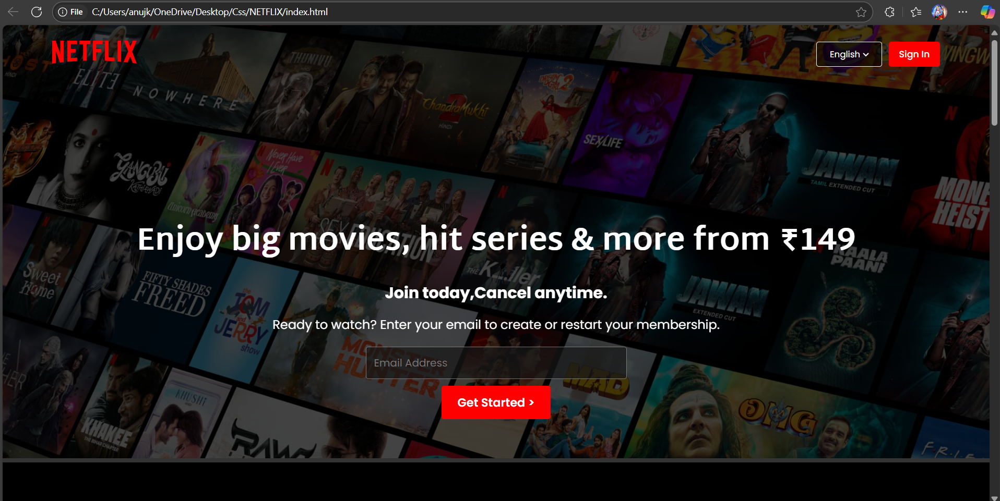

# Netflix-_clone
# 🎬 Netflix Clone

A responsive and animated Netflix-inspired web application built using modern front-end technologies. This clone showcases scroll-based animations, interactive UI components, and dynamic content to replicate the Netflix user experience.

## 🔥 Features

- 🎥 Hero banner with autoplay video/slider
- 🧭 Scroll-triggered animations using GSAP + ScrollTrigger
- 🎞️ Movie/TV show cards with hover effects
- 📱 Fully responsive layout for all screen sizes
- 🔍 Search bar UI (static/dynamic based on your setup)
- 🔗 Reusable components for sections like Navbar, Footer, etc.
- 📽️ Optional trailer popup / lightbox (if implemented)


## 🛠️ Tech Stack

- **HTML5 & CSS3**
- **JavaScript (ES6+)**
- **GSAP & ScrollTrigger**
- **Font Awesome / Custom Icons**
- **Responsive Design (Flexbox/Grid)**

## 📁 Folder Structure
Netflix-Clone/
├── index.html
├── style.css
├── script.js
├── assets/
│ ├── images/
│ └── screenshots/
│ └── homepage.png
└── README.md


## 📸 Screenshots



## 🧠 How It Works

- Uses GSAP for smooth transitions and animations
- ScrollTrigger pins sections and triggers effects based on scroll position
- Responsive layouts adjust using media queries and flexible containers

## 💡 Installation

To run the project locally:

```bash
git clone https://github.com/ritik-kumar123/netflix-_clone.git
cd netflix-clone
open index.html

No backend or API is used in this version.

✨ To-Do (Optional)
 Integrate TMDB API for real movie data

 Add login/signup functionality

 Include user profile and recommendations

 Add video player support

🙌 Acknowledgements
Netflix for the design inspiration

GSAP Documentation

Unsplash / TMDB for placeholder images

📬 Contact
Made with ❤️ by **Ritik Thakur**  
 [LinkedIn](https://linkedin.com/ritikkumar11114444) | [GitHub](https://github.com/ritik-kumar123)


